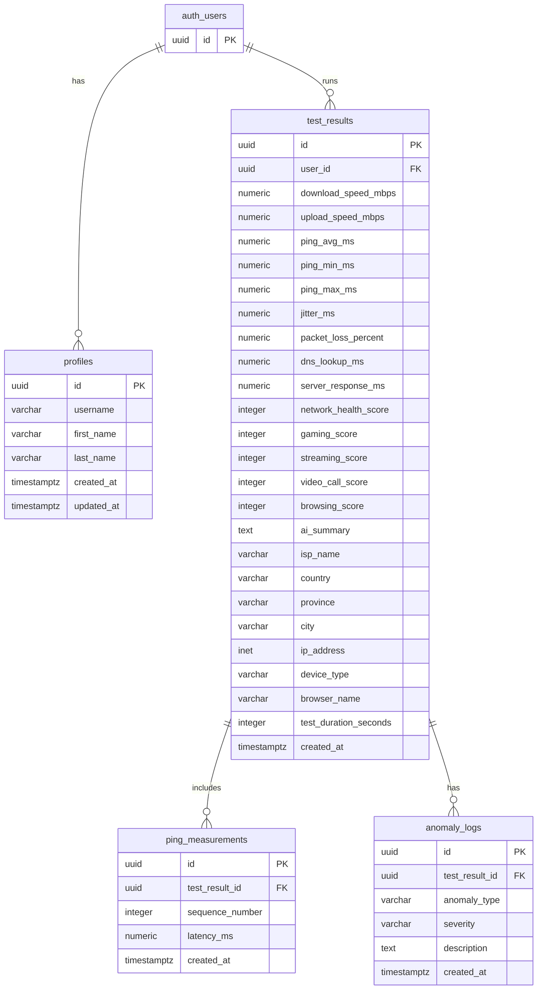

# CyberSecure Network Dashboard - Schema ER Diagram

## Key Relationships:
1. **auth.users ↔ profiles**: One-to-One (each user has one profile)
2. **auth.users ↔ test_results**: One-to-Many (one user runs many tests)
3. **test_results ↔ ping_measurements**: One-to-Many (one test has many ping samples)
4. **test_results ↔ anomaly_logs**: One-to-Many (one test has many anomalies)

## Additional Notes:
- All tables use UUIDs for primary keys
- Uses `auth.users` (Supabase Auth) for user management
- RLS policies ensure users only see their own data
- `network_summary` view aggregates user test data
