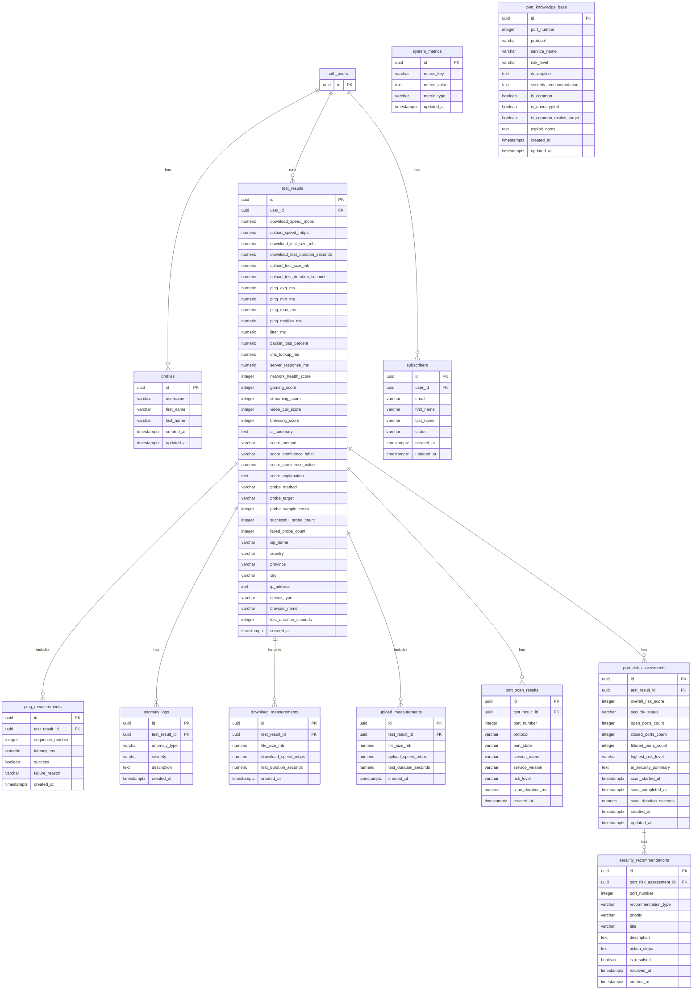

# AkovoLabs Speedtest - Complete Schema ER Diagram

## Key Relationships:

1. **auth.users ↔ profiles**: One-to-One (each user has one profile)
2. **auth.users ↔ subscribers**: One-to-One/One-to-Many (each user can have subscriber record)
3. **auth.users ↔ test_results**: One-to-Many (one user runs many tests)
4. **test_results ↔ ping_measurements**: One-to-Many (one test has many ping samples)
5. **test_results ↔ anomaly_logs**: One-to-Many (one test has many anomalies)
6. **test_results ↔ download_measurements**: One-to-Many (one test has many download samples)
7. **test_results ↔ upload_measurements**: One-to-Many (one test has many upload samples)
8. **test_results ↔ port_scan_results**: One-to-Many (one test has many port scan results)
9. **test_results ↔ port_risk_assessments**: One-to-One/One-to-Many (one test can have a port risk assessment)
10. **port_risk_assessments ↔ security_recommendations**: One-to-Many (one assessment can have many recommendations)

## Additional Notes:
- All tables use UUIDs for primary keys
- Uses `auth.users` (Supabase Auth) for user management
- RLS policies ensure users only see their own data
- Port Risk Detection tables track port scans, risk scores, and security recommendations
- System Metrics table stores public stats like user count and uptime
